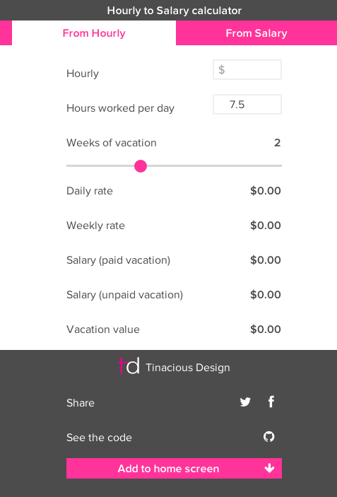
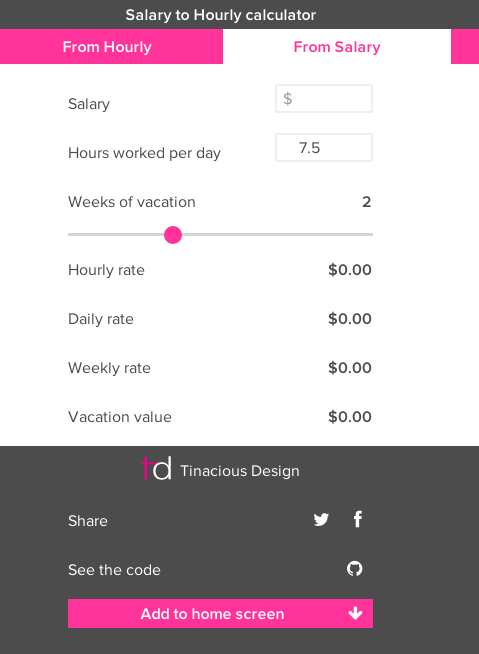

# Salary and Hourly Wage calculator

This is a quick calculator I built in Angular.js to roughly translate hourly wage to salary and salary to hourly wage. 

It does not take into account benefits or other types of compensation but rather serves simply to do the math that would be involved to calculate hours worked. 

It takes into account vacation time as well.

Check it out [here](http://tinacious.github.io/salary-hourly-calculator).

